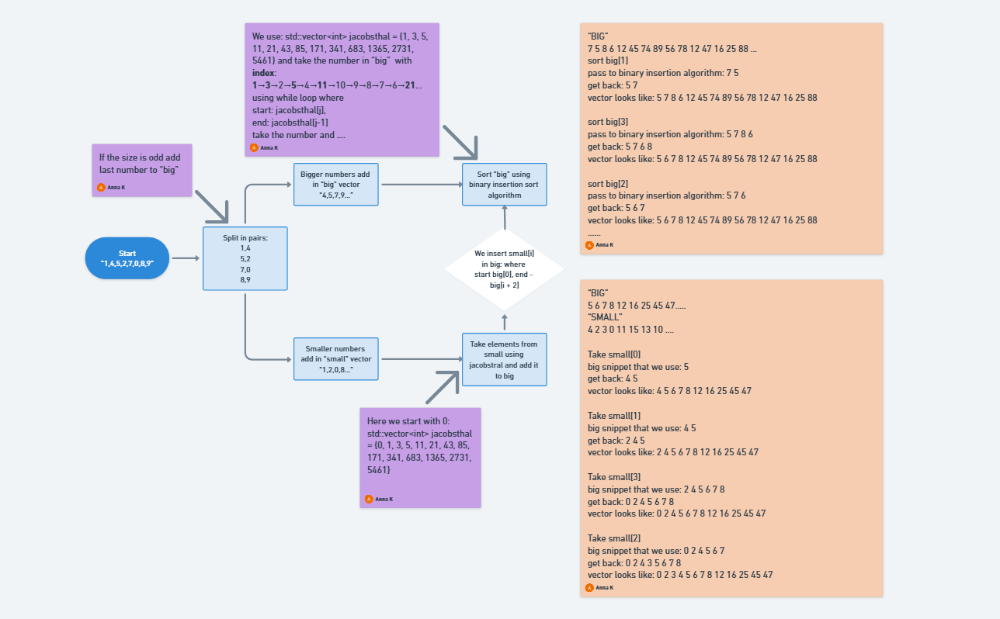

# PmergeMe
PmergeMe is a custom sorting algorithm implementation inspired by the Ford–Johnson Merge-Insertion Sort, optimized using the Jacobsthal sequence for efficient insertion ordering. It processes sequences using both std::vector and std::deque to demonstrate performance differences across container types.

### How It Works
The algorithm works by:

- Splitting the input into pairs of numbers.
- Dividing each pair into:
  - big elements (larger values of each pair)
  - small elements (smaller values of each pair)
- Sorting the big elements first using binary insertion, guided by the Jacobsthal sequence.
- Inserting the small elements back into the sorted sequence, again using binary insertion.
- Handling the last unpaired element, if the input size is odd.

The use of the Jacobsthal sequence helps optimize the order in which elements are inserted, reducing the number of comparisons and improving performance over naive insertion sort.
